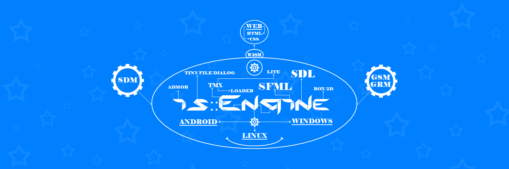

----------------------------

# is::Engine (Infinity Solutions::Engine) 3.3.2
Open source C++ framework which uses the mechanisms of **SFML 2** and which also allows to develop with several libraries at the same time **(SDL 2, SMK-Emscripten)** in order to easily export your games / applications on the **Web (HTML 5), Android** and **PC (Windows, Linux)**.

## Contents
- [Features](#features)
- [What's new in this version](#whats-new-in-this-version)
- [Extras](#extras)
- [Game Engine User Guide and Youtube Tutorial](#game-engine-user-guide-and-youtube-tutorial)
- [Example of a project created with the engine](#example-of-a-project-created-with-the-engine)
- [Hello Scene Example](#hello-scene-example)
- [Prerequisites](#prerequisites)
- [How to use is::Engine with the different development tools](#how-to-use-isengine-with-the-different-development-tools)
- [Description of the project structure](#description-of-the-project-structure)
- [How to update an is::Engine project](#how-to-update-an-isengine-project)
- [Special things to know about the engine](#special-things-to-know-about-the-engine)
- [How to activate the use of Admob](#how-to-activate-the-use-of-admob)
- [Contribute](#contribute)

## 

[](https://www.sfml-dev.org) [](https://www.libsdl.org/)  [](https://github.com/erincatto/box2d) [](https://www.mapeditor.org) [](https://github.com/ArthurSonzogni/smk) [](https://admob.google.com/) [](https://github.com/native-toolkit/tinyfiledialogs)

## Features
- Language manager (English and French language support by default)
- Scene System
- Automatic management of a window
- Run SFML game with SDL 2
- Multi support for development tools ([Android Studio](#-android-studio), 
[Qt](#-qt), 
[CMake](#-cmake), 
[Emscripten](#-web-html-5---css-3), 
[Visual Studio Code](#-visual-studio-code), 
[Code::Block](#-codeblocks))
- [is::LibConnect](#islibconnect)
- [Web Push Notification](#-web-push-notification)
- SDM (Step and Draw Manager)
- GSM (Game Sound Manager)
- GRM (Graphics Resources Manager)
- CFF (CMake Files Fusion)
- [TMX Lite](https://github.com/Is-Daouda/is-Engine-Example-Pack/tree/main/is-Engine-TMXLite)
- [TMX Loader (Old version)](https://github.com/Is-Daouda/is-Engine-TMXLoader)
- Entity system
- Object Event System
- [Button System](https://github.com/Is-Daouda/is-Engine-Example-Pack/tree/main/is-Engine-TinyFileDialog)
- Background System
- [Game Slider](https://github.com/Is-Daouda/is-Engine-Example-Pack/tree/main/is-Engine-GameSlider)
- [Sprite Animation](https://github.com/Is-Daouda/is-Engine-Example-Pack/tree/main/is-Engine-GameSlider)
- Basic collision engine
- [2D physic engine (Box 2D)](https://github.com/Is-Daouda/is-Engine-Example-Pack/tree/main/is-Engine-Box2D)
- Message Box System (Modifiable appearance via Sprites and Font)
- Dialog Box System (as for RPG games)
- [[Windows, Linux] Tiny File Dialogs to manage the dialog boxes of type: Message, File Save, Load File, Folder Selection](https://github.com/Is-Daouda/is-Engine-Example-Pack/tree/main/is-Engine-TinyFileDialog)
- [Game Configuration System (sound, music, language, keyboard key, file path, ...)](./app/src/main/cpp/app_src/config/GameConfig.h)
- Game Save System
- [[Android] Virtual Game Pad with 6 keys (multi directional cross and A - B button)](https://github.com/Is-Daouda/is-Engine-Example-Pack/tree/main/is-Engine-VirtualGamePad)
- [[Android] Virtual Game Pad Configuration (Adjust Position, transparency, ...)](https://github.com/Is-Daouda/is-Engine-Example-Pack/tree/main/is-Engine-VirtualGamePad)
- [[Android] Show Ad Banner](https://github.com/Is-Daouda/is-Engine-Example-Pack/tree/main/is-Engine-Admob)
- [[Android] Show Reward Video](https://github.com/Is-Daouda/is-Engine-Example-Pack/tree/main/is-Engine-Admob)

## What's new in this version
This release focuses more on improving engine resource management:
1. Fixed the bug which prevented the permanent deletion of files on the Web (HTML 5) (see the [removeFile](./app/src/main/cpp/isEngine/system/function/GameSystem.cpp#L138) function).
2. Delete unused resources and permissions on Android.
3. Optimizing the part of the engine that loads resources.<br>
You can notice it with this new version of [I Can Transform Web](https://is-daouda.github.io/). Now the levels load faster than before!

## Previous version
### 3.3.1
1. Fixed the bug that distorted images when using rotation.
2. Optimization of the rendering part of the engine that uses SDL. Games are now smoother!
3. Integration of a file saving system for the Web (HTML 5). No need to re-implement yours anymore!
4. The [OpenURL function](./app/src/main/cpp/isEngine/system/function/GameFunction.h#L982) now allows making phone calls (on Android) and contacting by email.
```cpp
is::openURL("www.yoursiteweb.com", is::OpenURLAction::Http); // open link
is::openURL("youremail@gmail.com", is::OpenURLAction::Email); // open email
is::openURL("+2280011223344", is::OpenURLAction::Tel); // Make a call
```

### 3.3
1. **[The is::LibConnect function](#islibconnect)**: Allows you to develop with several game libraries at the same time (SFML, SDL 2, SMK (Emscripten)) in one and the same project!
2. **[Possibility to develop C++ SFML games with SDL 2](#-develop-sfml-games-with-sdl-2)** (Your SFML games will run on the SDL 2 library! Yes, yes it is possible!). Book for Code::Block users for the moment!
3. **Support for Android x64 architectures**: Now you can export your C++ games to several Android architectures (armeabi-v7a, arm64-v8a, x86, x64, ...).
Which means that you can now publish your C++ games on Google Play! (Yeaaah !!!)
- [You must read this very important](#-very-important)
4. **[The OpenURL function](./app/src/main/cpp/isEngine/system/function/GameFunction.h#L982) now allows you to open web links on many system**: PC (Windows / Linux), Web (HTML 5), Android.
5. **[A new function to manipulate dates](./app/src/main/cpp/isEngine/system/function/GameFunction.h#L111)**
- Very practical data sending system for sending C++ data to Javascript.

*Example code to display C++ data in Javascript:*
```cpp
std::vector<std::string> vectorArray;
vectorArray.push_back("is::Engine is really great!");
vectorArray.push_back("With this tool everything is possible!");
vectorArray.push_back("I'm sure you'll love it!");

// The javascripts part
EM_ASM_ARGS({
    var vectorArray = new Module.VectorString($0);
    console.log(vectorArray.get(0));
    console.log(vectorArray.get(1));
    console.log(vectorArray.get(2));
    }, &vectorArray);
```
*Output in the browser console:*
```
is::Engine is really great!
With this tool everything is possible!
I'm sure you'll love it!
```
## Extras
- Here is a **[Web Game : Arkanoid](https://is-daouda.github.io/)** created with the game engine.
**It's a Web Game so it's playable on PC and mobile.**

[](https://is-daouda.github.io/)

- The engine comes with a **[Demo (2D Platform Game)](https://github.com/Is-Daouda/is-Engine-Demo)** that uses only the functions of the engine, in order to show you its power and how to use it. Now imagine what you can do when you use Box 2D and the other tools!

[](https://github.com/Is-Daouda/is-Engine-Demo)

- [Example Pack](https://github.com/Is-Daouda/is-Engine-Example-Pack) that show how to use the various features of the game engine.

## Game Engine User Guide and Youtube Tutorial
- [English version](./doc/isEngine_api_doc_eng.html)
- [French version](./doc/isEngine_api_doc_fr.html)
- [Youtube tutorial : How to import an SFML project into is::Engine](https://youtu.be/x_YQLHoPMbc)
- [Youtube tutorial : How to create a game (Arkanoid) with the game engine](https://youtu.be/wo2-ofNB7Hw)

## Example of a project created with the engine
- [I Can Transform Web](https://is-daouda.github.io/)
- [I Can Transform Android](https://play.google.com/store/apps/details?id=com.isdaouda.icantransform&hl=En)
- [Pac-Pac Prandial War](https://www.youtube.com/watch?v=7CXkiD_jTRg&t=25s&authuser=0)
- [Soldier VS Zombies](https://www.youtube.com/watch?v=qK-Aj-7-czM&authuser=0)

## Hello Scene Example
Here is an example code of a Scene (the place where the game objects come to life).
**In less than 50 lines of code, the engine allows to:**
- Change the language of the game (English / French)
- Display an RPG type message with interaction
- Animate an **[object](./app/src/main/cpp/app_src/objects/HelloWorld.h)** with the possibility of interacting with it (by clicking / touching it)
- Load resources (Textures, Music)
- Play music
- Display a background that scrolls vertically and horizontally with a speed
- Manages the display depth of each object
- Automatically manages the game window (closing confirmation, events, ...)
- Change the background color of the window (scene color)

```cpp
class HelloScene : public is::GameDisplay {
public:
    HelloScene(is::GameSystemExtended &gameSysExt):
        GameDisplay(gameSysExt, sf::Color::White /* => scene color*/) {}

    void loadResources() {
        m_gameSysExt.m_gameLanguage = is::lang::ENGLISH; // set default game language

        // uncomment to change English language in French
        // m_gameSysExt.m_gameLanguage = is::lang::FRANCAIS;

        // load font and texture
        GameDisplay::loadParentResources(); // allows to load system resource (very important never forgot to call him)
        GRMaddTexture("hello_world", is::GameConfig::SPRITES_DIR + "hello_world.png");
        auto &texBg = GRMaddTexture("background", is::GameConfig::TILES_DIR + "background.png");
        auto &texDialog = GRMaddTexture("dialog_box", is::GameConfig::GUI_DIR + "dialog_box.png");

        // add a background to the position x = 0, y = 0 which will fill the scene and which will be scrolled (scrolling speed = 0.5)
        SDMaddSceneObject(std::make_shared<is::Background>(texBg, 0.f, 0.f, this, 0.5f, -0.5f, false, false));

        // add an object at position x = 0, y = 0 which will be updated and displayed in the scene
        SDMaddSceneObject(std::make_shared<HelloWorld>(0.f, 0.f, this));

        // add RPG style game dialog
        auto gameDialog = std::make_shared<is::GameDialog>(texDialog, GRMgetFont("font_msg"), this);
        gameDialog->setDepth(-2); // the display depth (make it appear on all objects. The object with the smallest value appears on the others)
        gameDialog->setDialog(is::GameDialog::DialogIndex::DIALOG_HELLO); // set the corresponding dialog (See GameDialog.h and GameLanguage.h for more details on creating a message for dialogue)
        SDMaddSceneObject(gameDialog);

        GSMaddSound("game_music", is::GameConfig::MUSIC_DIR + "game_music.wav"); // add music
        GSMplaySound("game_music"); // play music
    }
};
```

## Prerequisites
- [SFML Library (2.4 +)](https://www.sfml-dev.org/download.php)
- [SDL 2 (2.0.12 +)]()
- GCC Compiler (7.3 +)

---

## How to use is::Engine with the different development tools:
##  Android Studio
This project uses the template of **[Georgik](https://github.com/georgik/sdl2-android-example)** and **[Lauchmelder23](https://github.com/Lauchmelder23/SDLU)**.

**1. Prerequisites**
- Android Studio (4.0.1 +)
- Android SDK and NDK (r20b)

##  Very important
- On Android SFML games run with SDL library. If you want to use SDL functions in your source code, use the **IS_ENGINE_SDL_2 macro**.
- The audio format supported at the moment is **.WAV**
- Some SFML functions like: **Vertex Array, Render Texture** are not yet supported. These additions will be made soon!
- **Your help to improve the engine will be welcome!**
- [Please read this](#Contribute).

**2. Installation**
##### Windows
1. Download [Android Studio 3.x](https://developer.android.com/studio) (recommended version 4.0.1).
2. Download the [Android SDK](https://developer.android.com/studio) and install it in **C:/Android/SDK**.
3. Download [Android NDK android-ndk-r20b-windows-x86_64](https://developer.android.com/ndk/downloads/older_releases.html) and create a folder on your disk as follows **C:/Android/NDK** then extract the contents of the zip in this folder.
4. Set the environment variable **ANDROID_NDK** with the path **C:/Android/NDK**.
6. Move the **is-Engine** project to your **C:/ (C:/is-Engine)**.
7. Open the **is-Engine** folder with **Android Studio** and start the compilation.

If all goes well you will have a **Hello World Screen** on your **Android emulator**.


**Enjoy!**

**2. How to replace the package name (com.author.isengine) of the application**
- Follow these steps carefully. A single error and the application will crash wonderfully when launching on emulator / mobile!
1. Replace this line in the [gradle.app](./app/build.gradle#L32) file.
2. Replace this line in the [AndroidManifest.xml](./app/src/main/AndroidManifest.xml#L3) file.
3. Replace this line in the [SDLActivity.java](./app/src/main/java/com/author/isengine/SDLActivity.java#L1) file.
4. Replace the abresence **[com/author/isengine](./app/src/main/java/com/author/isengine/)** in which is the file [SDLActivity.java](./app/src/main/java/com/author/isengine/SDLActivity.java#L1) that you have just modified at the top by yours (example **com/yourname/yourgamename**).
5. Replace this part **..._ com_author_isengine _...** of line [20](./app/src/main/cpp/SDL_android_main.c#L20) and [23](./app/src/main/cpp/SDL_android_main.c#L23) in the file [SDL_android_main.c](./app/src/main/cpp/SDL_android_main.c#L20) by yours (example **com_yourname_yourgamename)**.
6. Replace this part **..._ com_author_isengine _...** on the 23 lines of the file [SDL_android.c](./libs/SDL2/src/core/android/SDL_android.c#L156) by yours (example **com_yourname_yourgamename**).
- **I strongly advise you to use the replace function of your text editor** (on Notepad++ we use Ctrl + F + Replace option).
7. Replace this line in the [GameConfig.h](./app/src/main/cpp/app_src/config/GameConfig.h#L148) file.
- Note that this part is only required if you want to use the game engine data save / load functions.

**3. Adding Source Files**
- So that Android Studio can detect your source files (.cpp) you must include them in the **[app_src.cmake](./app/src/main/cmake/app_src.cmake) or [isengine.cmake](./app/src/main/cmake/isengine.cmake)** file which is located in the **[is-Engine/app/src/main/cmake](./app/src/main/cmake/)** location.

**4. Application location**
- The application can be found in **is-Engine/app/build/outputs/apk**.

---

##  Web (HTML 5 - CSS 3)
- If you want to make your SFML project compatible with the Web (Be able to run it in a web browser), please watch this **[video tutorial](https://youtu.be/x_YQLHoPMbc)**.

**1. Prerequisites**
- Emscripen (1.39.7 +)
- Python (3.8.1 +)
- CMake (3.1 +)
- Java
- SMK SDK **(It is downloaded with the internet connection when executing commands)**

**2. Installation**
##### Windows
1. Download [Emscripten](https://github.com/emscripten-core/emsdk) and install it in **C:/emsdk**, define its path in the environment variable **Path**
2. Download [Python](https://www.python.org/downloads/release/python-381/) after installation, define its path in the environment variable **Path**
3. Download [CMake](https://cmake.org/download/) after installation, define its path in the environment variable **Path**
4. Download [Java](https://www.oracle.com/java/technologies/javase-jre8-downloads.html) after installation, define its path in the environment variable **Path**
5. Move the **is-Engine** project to your **C:/ (C:/is-Engine)**.
6. Execute this command :
```bash
cd c:/is-Engine/app/src/main
mkdir bin-web
cd bin-web
emsdk activate latest
emcmake cmake ..
make -j3
python -m http.server
```
7. Visit this url **localhost:8000** in your **Web Browser**.

If all goes well you will have a **Hello World Screen** on your **Web Browser**.


**Enjoy!**

**3. Adding Source Files**
- In order for CMake to detect your source files (.cpp) you must include them in the **[app_src.cmake](./app/src/main/cmake/app_src.cmake) or [isengine.cmake](./app/src/main/cmake/isengine.cmake)** file which is located in the **[is-Engine/app/src/main/cmake](./app/src/main/cmake/)** location.

##  Very important
- **is::Engine** works on the Web thanks to **[SMK](https://github.com/ArthurSonzogni/smk)** a C++ library which uses **[Emscripten](https://emscripten.org)**.
- **SMK** is a **library** which is a **little different** from **SFML**, but the **Graphic, Audio, System** part looks a bit like that of **SFML**.
- It does not currently support some SFML features such as: Events, loadFromFile / openFromFile (they are replaced by functions of the engine which performs the same role), etc. The way objects initialize is a little different too. Even the names spaces and functions are different.
- **is::Engine** allows to **interconnect the SMK and SFML library**, so that they can use the same **namespace (sf), Classes and functions names** in order to facilitate development (avoid preprocessors, compatibility with several platforms).
- When using SMK with with is::Engine, the Music class works the same as sf::Sound.
- These libraries: **SWOOSH, TMXLite, TMXLoader, TinyFileDialog** are not supported in the web version of is::Engine.
- But don't worry, **AS LONG AS YOU USE THE FEATURES OF is::Engine you won't notice the difference between these two (2) libraries when you create your games**.
- Believe me, there is everything you need to create a great game!
- To see the differences I advise you to see the **[basicSFMLmain.cpp](./app/src/main/cpp/basicSFMLmain.cpp) file** (this file allows you to create your games without using the main rendering loop of the engine, i.e. avoids using the main features of the engine).
- If you want more information on the SMK library I advise you to see [the documentation](https://arthursonzogni.com/SMK/doc/).

---

##  Web Push Notification
- If you want to make your SFML project compatible with the Web (Be able to run it in a web browser), please watch this **[video tutorial](https://youtu.be/x_YQLHoPMbc)**.

- <br>
By default the web push notification has been disabled. Because to make it work you must have an internet connection. In case there is no internet access and it is not well launched, it can prevent the execution of the web program.<br>
To enable it, please modify these lines in **[index.html](./app/src/main/web/index.html)** : **[9](./app/src/main/web/index.html#L9), [25](./app/src/main/web/index.html#L25), [68](./app/src/main/web/index.html#L68)**

#### Installation
- This shows how to test the push notification. Note that normally to use it, you have to associate it with a database (backend). But here we will use it with the **Push Companion** site **(It will serve as a backend for us!)**.
- For more information on Push Notification please see this [page](https://developers.google.com/web/fundamentals/codelabs/push-notifications).
1. Web browser ([preferably Google Chrome](https://www.google.fr/chrome/?brand=CHBD&brand=XXVF&gclid=EAIaIQobChMI7a315b6c7gIVEKSyCh0O8QJjEAAYASABEgJfd_D_BwE&gclsrc=aw.ds))
2. [Web server for Chrome](https://chrome.google.com/webstore/detail/web-server-for-chrome/ofhbbkphhbklhfoeikjpcbhemlocgigb) or your own web server.
3. Define the **Application Server Keys** in the [main.js](./app/src/main/web/scripts/main.js#L25) file. You can get this keys (We will use the public key) [here](https://web-push-codelab.glitch.me/).
4. Launch the **[web](./app/src/main/web)** or **bin-web folder (generate using emscripten)** via the web server.
5. Click on the **"Enable Push Messaging" button** to activate the sending of Push Notifications. Once done you will have a code (which can be used to send you push notifications).
6. Go to this [site](https://web-push-codelab.glitch.me/) and enter the code in the **"Subscription to Send To" text field** followed by your message in **"Text to Send" text field**. Click on the **"Send Push Message" button**.
7. If all goes well you will have a push notification followed by the message you sent in the console (development tool) of your browser.


#### Configure the Push Notification
1. To change the **information (title, details, ...)** of the Push Notification you must refer to the [sw.js](./app/src/main/web/sw.js#L28) file.
2. To change the **Push Notification image** files, refer to the [images](./app/src/main/web/images) folder.
3. To change the **page that is launched** when you click on the notification, refer to the [sw.js](./app/src/main/web/sw.js#L45) file.

---

##  CMake
**1. Prerequisites**
- CMake (3.1 +)

**2. Installation**
#### Windows
1. Compile SFML with CMake to have **static libraries** and put on **C:/ (C:/SFML)**.
2. Move the **is-Engine** project to your **C:/ (C:/is-Engine)**.
3. Execute this command :
```bash
cmake -S "C:/is-Engine" -B "C:/build"
cd build
make
```

#### Linux
1. Install SFML 2.5.1 on your machine.
2. Move the **is-Engine** project to **/home/user/ (/home/user/is-Engine)**.
3. Execute this command :
```bash
sudo cmake -S "is-Engine" -B "build"
cd build
sudo make
```

**3. After installation**
- You will have a **bin** folder in which the engine demo is located.

**5. Adding Source Files**
- In order for CMake to detect your source files (.cpp) you must include them in the **[app_src.cmake](./app/src/main/cmake/app_src.cmake) or [isengine.cmake](./app/src/main/cmake/isengine.cmake)** file which is located in the **[is-Engine/app/src/main/cmake](./app/src/main/cmake/)** location.

---

##  Qt

**1. Installation**
#### Windows
1. Download Qt 5.12.9 MinGW [here](http://qtproject.mirror.liquidtelecom.com/archive/qt/5.12/5.12.9/qt-opensource-windows-x86-5.12.9.exe) and install it.
2. Download this [version of SFML](https://github.com/Is-Daouda/SFML_Qt_MinGW) already compiled for Qt 5.12.9 and extract it in **C:/ (C:/SFML_Qt_MinGW)**.

**2. Opening the project with the IDE:**

#### Windows
1. Run the file **open_qt_creator.bat** in the main directory *(Make sure you have included the path to the Qt executable in your PATH environment variable)*.
2. Or open the file **is-Engine.pro** in the location **[is-Engine/app/src/main/qt](./app/src/main/qt/)**

**3. Executable location**
- The compiler files can be found in **is-Engine/app/src/main/bin-Qt**.

---

##  Visual Studio Code
This project uses the template of **andrew-r-king**. For more information on this template [click here](https://github.com/andrew-r-king/sfml-vscode-boilerplate).

**1. Prerequisites**
#### Windows
- [SFML 2.5.1 - GCC 7.3.0 MinGW (DW2) 32-bit](https://www.sfml-dev.org/files/SFML-2.5.1-windows-gcc-7.3.0-mingw-32-bit.zip)
- [GCC 7.3.0 MinGW (DW2) 32-bit](https://sourceforge.net/projects/mingw-w64/files/Toolchains%20targetting%20Win32/Personal%20Builds/mingw-builds/7.3.0/threads-posix/dwarf/i686-7.3.0-release-posix-dwarf-rt_v5-rev0.7z/download)
- [Git Bash](https://git-scm.com/downloads)

#### Linux
- Get SFML 2.5.1 from your distro if it has it, or compile from source.

**2. Installation**
#### Windows
1. Download & Extract SFML 2.5.1 to **C:/SFML/** where the bin/lib/include folders are contained within.
2. Download & Extract MinGW to **C:/mingw32/** where the bin/lib/include folders are contained within.

#### Linux
1. Ensure the GCC Toolchain is installed (**sudo apt install build-essential**).
2. Run **sudo apt install libsfml-dev**. The SFML version you got will vary depending on the distro. 2.5.1 is included in [Ubuntu 19.04 Disco Dingo](http://cdimage.ubuntu.com/daily-live/current/HEADER.html) for example.

**3. Opening the project with the IDE:**
#### Windows
1. Run the file **open_vscode.bat** in the main directory.

#### Linux
2. Execute this command in the main directory:
```bash
code -n "./app/src/main"
```

#### All
3. Or open the **[is-Engine/app/src/main](./app/src/main/)** folder with **Solution Explorer**.

**4. Executable location**
- The compiler files can be found in **is-Engine/app/src/main/bin-vscode**.

---

##  Code::Blocks

**1. Installation**
#### Windows
1. Download Code::Blocks 20.03 MinGW [here](https://sourceforge.net/projects/codeblocks/files/Binaries/20.03/Windows/codeblocks-20.03mingw-setup.exe/download) and install it.
2. Download this [version of SFML](https://github.com/Is-Daouda/SFML_CB_MinGW) already compiled for Code::Blocks 20.03 and extract it in **C:/ (C:/SFML_CB_MinGW)**.

#### Linux
1. Download Code::Blocks 20.03 and install it.
2. Ensure the GCC Toolchain is installed (**sudo apt install build-essential**).
3. Run **sudo apt install libsfml-dev**. The SFML version you got will vary depending on the distro. 2.5.1 is included in [Ubuntu 19.04 Disco Dingo](http://cdimage.ubuntu.com/daily-live/current/HEADER.html) for example.

**2. Opening the project with the IDE:**

#### Windows
1. Run the file **open_codeblocks.bat** in the main directory *(Make sure you have included the path to the Code::Blocks executable in your PATH environment variable)*.
2. Or open the file **is-Engine-windows.cbp** in the location **[is-Engine/app/src/main](./app/src/main/)**

#### Linux
1. Execute this command in the main directory:
```bash
codeblocks "./app/src/main/is-Engine-linux.cbp"
```
2. Or open the file **is-Engine-linux.cbp** in the location **[is-Engine/app/src/main](./app/src/main/)**.

**3. Executable location**
- The compiler files can be found in **is-Engine/app/src/main/bin-codeblocks**.

---

##  Develop SFML games with SDL 2

**1. Installation**
#### Windows
1. Download Code::Blocks 20.03 MinGW [here](https://sourceforge.net/projects/codeblocks/files/Binaries/20.03/Windows/codeblocks-20.03mingw-setup.exe/download) and install it.
2. Download this [version of SDL 2](https://github.com/Is-Daouda/SDL2) and extract it in **C:/ (C:/SDL2)**.
3. Put the **.dll files** which is in the **bin** folder of SDL2 in the **[main](./app/src/main/)** folder.

**2. Opening the project with the IDE:**
1. Run the file **open_codeblocks_sdl.bat** in the main directory *(Make sure you have included the path to the Code::Blocks executable in your PATH environment variable)*.
2. Or open the file **is-Engine-windows-SDL2.cbp** in the location **[is-Engine/app/src/main](./app/src/main/)**

**3. Executable location**
- The compiler files can be found in **is-Engine/app/src/main/bin-codeblocks**.

##  Very important
- If you want to use SDL functions in your source code, use the **IS_ENGINE_SDL_2 macro**.
- Note that some SFML functions like: **Vertex Array, Render Texture** are not yet supported. These additions will be made soon!

---

##  Change application icon:
#### Android
- To change the icon of the application you must go to the location **[is-Engine/app/src/main/res](./app/src/main/res/)** replace all the images (PNG) which are in the **drawable** subfolders.

#### Web (HTML 5 - CSS 3)
- To change the icon of the application you must go to the location **[is-Engine/app/src/main/web](./app/src/main/web/)**.

#### Windows
- To change the icon of the application you must go to the location **[is-Engine/app/src/main/env/windows](./app/src/main/env/windows)** replace all the images **(Attention CMake uses the same resources).**

#### Linux
- To change the icon of the application you must go to the location **[is-Engine/app/src/main/env/linux](./app/src/main/env/linux)**.

---

## Description of the project structure:

----------------------------
- The source files of the project can be found in the **[is-Engine/app/src/main/cpp](./app/src/main/cpp/)** location.

#### 1. [main.cpp](./app/src/main/cpp/main.cpp) file
Contains the entry point of the program, inside there are two instructions :
- `game.play()`: Launches the engine rendering loop which allows to manage the introduction screen, main menu, level and game over.
- `game.basicSFMLmain()` (disabled by default): Launches the display of a classic SFML window. The implementation is in the **[basicSFMLmain.cpp](./app/src/main/cpp/basicSFMLmain.cpp)** file. *Very useful if you already have a project under development and you want to associate it with the engine. You can also use it to implement your own components to the engine.*

----------------------------
#### 2. [app_src](./app/src/main/cpp/app_src/) folder
Contains the source code of the game.
Description of these sub-directories:
- **[activity](./app/src/main/cpp/app_src/activity/)** : Contains the **[Activity](./app/src/main/cpp/app_src/activity/GameActivity.h)** class which allows the interaction of the different scenes of the game.
- **[config](./app/src/main/cpp/app_src/config/)** : Contains the **[GameConfig.h](./app/src/main/cpp/app_src/config/GameConfig.h)** file which allows to define the general parameters of the game. It also contains the file **[ExtraConfig.h](./app/src/main/cpp/app_src/config/ExtraConfig.h)** which allows to activate / deactivate certain engine functionality (Engine optimization, SDM, Admob, Main Render Loop, ...).
- **[gamesystem_ext](./app/src/main/cpp/app_src/gamesystem_ext/)** : Contains **[GameSystemExtended](./app/src/main/cpp/app_src/gamesystem_ext/GameSystemExtended.h)** a class derived from **[GameSystem](./app/src/main/cpp/isEngine/system/function/GameSystem.h)** which allows to manipulate game data (save, load, ...).
- **[language](./app/src/main/cpp/app_src/language/)** : Contains the **[GameLanguage.h](./app/src/main/cpp/app_src/language/GameLanguage.h)** file which allows to manage everything related to game languages.
- **[levels](./app/src/main/cpp/app_src/levels/)** : Contains game levels and the **[Level.h](./app/src/main/cpp/app_src/levels/Level.h)** file which allows to integrate them into the game.
- **[objects](./app/src/main/cpp/app_src/objects/)** : Contains the objects that will be used in the different scenes.
- **[scenes](./app/src/main/cpp/app_src/scenes/)** : Contains the different scenes of the game (Introduction, Main menu, ...).

----------------------------
#### 3. [assets](./app/src/main/assets/) folder
Contains game resource files (music, sound sfx, image, ...)

----------------------------
#### 4. [isEngine](./app/src/main/cpp/isEngine/) folder
Contains the source code of the game engine

---

## Special things to know about the engine
### is::LibConnect
With the is::LibConnect you can write code for a specific library. Here is how to do it:
```cpp
sf::Text text;
text.setString(
// on PC (Windows / Linux)
#if define(IS_ENGINE_SFML)    
    "We use SFML 2 library"

// on Android or when you use SDL to create SFML games on PC (only for Code::Block at the moment)    
#elif define(IS_ENGINE_SDL_2)
    "Run SFML 2 with SDL 2"

// When we develop for the web (HTML 5) with Emscripten    
#elif define(IS_ENGINE_HTML_5)
    "SFML 2 on Web"
#endif
              );
```

#### If you have discovered another way to use the game engine, don't hesitate to share it! We will put it in this Special section so that other people can benefit from it!

---

## How to update an is::Engine project
1. First of all the part of is::Engine that changes most often during updates is the [isEngine](./app/src/main/cpp/isEngine/) folder. But it also happens that these files can be modified:
- [GameActivity.h](./app/src/main/cpp/app_src/activity/GameActivity.h)
- [GameConfig.h](./app/src/main/cpp/app_src/language/GameLanguage.h)
- [ExtraConfig.h](./app/src/main/cpp/app_src/config/ExtraConfig.h)
- [GameSystemExtended.h](./app/src/main/cpp/app_src/gamesystem_ext/GameSystemExtended.h)
- [basicSFMLmain.cpp](./app/src/main/cpp/basicSFMLmain.cpp)
- [GameLanguage.h](./app/src/main/cpp/app_src/language/GameLanguage.h)
- And the files which is in [cmake](./app/src/main/cmake) and [web](./app/src/main/web) folder.
-  **So watch them carefully in case you encounter any errors during migration!**
2. To update your old project with a new version of is::Engine: the files (.h and .cpp) you need to move are in [objects](./app/src/main/cpp/app_src/objects/) and [scenes](./app/src/main/cpp/app_src/scenes/). **Note that these folders never change whatever the version!**

---

## How to activate the use of Admob?
Coming soon!

---

## Contribute
- If you want to participate in the development of the project to help me improve the engine, please note that you are welcome! Together we go further!
- One of the objectives of this project is to create a large community that can work on the engine to allow many people around the world to easily realize their dream games / applications!

## Contacts
  * For any help please contact me on my [email address](mailto:isdaouda.n@gmail.com)
  * You can follow me on Twitter for more informations on my activities [@Is Daouda Games](https://twitter.com/IsDaouda_Games)
