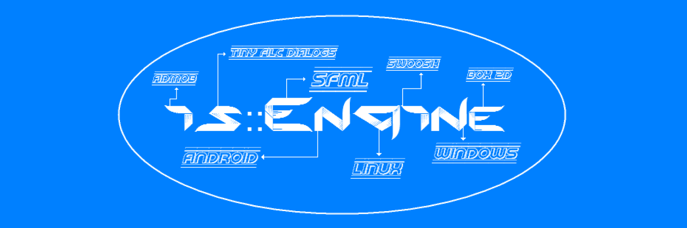

----------------------------

# is::Engine (Infinity Solutions::Engine) v2.0

is::Engine is a 2D game engine based on SFML which allows you to easily develop video games on PC (Windows, Linux) and Android. It integrates SWOOSH, Box 2D, Admob, Tiny File Dialogs and components that allows you to manage the different parts of a game: introduction, main menu with options, levels, game over (You no longer need to implement them!).

[](https://www.sfml-dev.org) [](https://github.com/TheMaverickProgrammer/Swoosh) [](https://github.com/erincatto/box2d) [](https://admob.google.com/) [](https://github.com/native-toolkit/tinyfiledialogs)

## Features
- Language manager (English and French language support by default)
- Scene System
- Entity system
- Sprite Animation
- 2D physic engine (Box 2D)
- Screen Transition effect (SWOOSH Library)
- [Level Editor](https://github.com/Is-Daouda/is-Level-Editor)
- Message Box System (Modifiable appearance via Sprites and Font)
- Dialog Box System (as for RPG games)
- [Windows, Linux] Tiny File Dialogs to manage the dialog boxes of type: Message, File Save, Load File, Folder Selection
- Game Configuration System (sound, music, language, keyboard key, file path, ...)
- Game Save System
- [Android] Virtual Game Pad with 6 keys (multi directional cross and A - B button)
- [Android] Virtual Game Pad Configuration (Adjust Position, transparency, ...)
- [Android] Show Ad Banner
- [Android] Show Reward Video

## Extras
The engine comes with an example (2D platform game) that uses only the functions of the engine, in order to show you its power and how to use it. Now imagine what you can do when you use Box 2D and the other tools!

## In this directory you have tree (3) projects :
- **AndroidStudio**        : for Android development with Android Studio ([Demo Project](https://drive.google.com/open?id=1YoWzrhV-PbnQwzqinU32l0p78qyKzNkp))
- **CodeBlocks**           : for PC development with Code::Blocks
- **VSCode**               : for PC development with Visual Studio Code

## Prerequisites
- SFML Library (2.4 +)

**AndroidStudio**
- Install Android Studio (3.1.3 +)
- Android SDK and NDK (r12b)
- Firebase C++ SDK 4.5.0 (If you need it)

**CodeBlocks**
- Install Code::Blocks (17.12)
- GCC Compiler

**VSCode**
- Visual Studio Code (1.42.0 +)
- GCC Compiler
- Git Bash (For Windows only)

## Todo
Everything has already been configured all you need to do in relation to the tree (3) projects is to link the libraries

## Description of the project structure:

```
Project
    |_ app_src
    	|_ activity
    	|_ config
    	|_ gamesystem_ext
    	|_ language
    	|_ levels
    	|_ objects
    	|_ scenes
    |_ data
    |_ isEngine
    basicSFMLmain.cpp
    main.cpp
```
----------------------------
#### The `main.cpp` file
Contains the entry point of the program, inside there are two instructions :
- `game.play()`: Launches the engine rendering loop which allows to manage the introduction screen, main menu, level and game over.
- `game.basicSFMLmain()` (disabled by default): Launches the display of a classic SFML window. The implementation is in the `basicSFMLmain.cpp` file. *Very useful if you already have a project under development and you want to associate it with the engine. You can also use it to implement your own components to the engine.*

----------------------------
#### `app_src` folder
Contains the source code of the game.
Description of these sub-directories:
- `activity` : Contains the `Activity` class which allows the interaction of the different scenes of the game
- `config`   : Contains the `GameConfig.cpp` file which allows to define the general parameters of the game
- `gamesystem_ext` : Contains a class derived from `GameSystem` which allows to manipulate game data (save, load, ...)
- `language` : Contains the `GameLanguage.cpp` file which allows to manage everything related to game languages
- `levels`   : Contains game levels and the `Level.h` file which allows to integrate them into the game
- `objects`  : Contains the objects that will be used in the different scenes
- `scenes`   : Allows to implement the different scenes of the game (Introduction, Main menu, ...)

----------------------------
#### `data` folder
Contains game resource files (music, sound sfx, image, ...)

----------------------------
#### `isEngine` folder
Contains the source code of the game engine

## Contribute
You have any ideas ? Well don’t hesitate to participate in the development of this engine. Because one of the objectives of this project is to form a community that will work on the engine to make it more efficient and easy to use for everyone.

## Contacts
  * For any help or other contribution please contact me on my [email address](mailto:isdaouda.n@gmail.com)
  * You can follow me on Twitter for more informations on my activities [@Is Daouda Games](https://twitter.com/IsDaouda_Games)