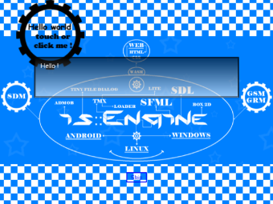

----------------------------

# is::Engine (Infinity Solutions::Engine) 3.1

Open source C++ game engine based on **SFML** which allows you to easily develop games on **Web (HTML 5 - CSS 3), Android and PC (Windows, Linux)**.

[](https://www.sfml-dev.org)  [](https://github.com/erincatto/box2d) [](https://www.mapeditor.org) [](https://github.com/ArthurSonzogni/smk) [](https://admob.google.com/) [](https://github.com/TheMaverickProgrammer/Swoosh) [](https://github.com/native-toolkit/tinyfiledialogs)

## Features
- Language manager (English and French language support by default)
- Scene System
- Automatic management of a window
- SDM (Step and Draw Manager)
- GSM (Game Sound Manager)
- GRM (Graphics Resources Manager)
- CFF (CMake Files Fusion)
- [TMX Lite](https://github.com/Is-Daouda/is-Engine-TMXLite)
- [TMX Loader](https://github.com/Is-Daouda/is-Engine-TMXLoader)
- Entity system
- Object Event System
- Button System
- Background System
- Sprite Animation
- Basic collision engine
- 2D physic engine (Box 2D)
- Screen Transition effect (SWOOSH Library)
- Message Box System (Modifiable appearance via Sprites and Font)
- Dialog Box System (as for RPG games)
- [Windows, Linux] Tiny File Dialogs to manage the dialog boxes of type: Message, File Save, Load File, Folder Selection
- Game Configuration System (sound, music, language, keyboard key, file path, ...)
- Game Save System
- [Android] Virtual Game Pad with 6 keys (multi directional cross and A - B button)
- [Android] Virtual Game Pad Configuration (Adjust Position, transparency, ...)
- [Android] Show Ad Banner
- [Android] Show Reward Video

## What's new in version 3.1 ?
1. **Web support (HTML 5 - CSS 3):** you can now run your C / C ++ games in a web browser thanks to the **[SMK (Simple Multimedia Kit)](https://github.com/ArthurSonzogni/smk)** library which is based on **[Emscripten Technology](https://emscripten.org/)**.
- ***[Please read this it is VERY IMPORTANT!](#-very-important)*** 
2. **GRM (Graphics Resources Manager) system:** allows you to use **Textures and Fonts** without using (instantiating) an **SFML object** in the code.
3. **CFF (CMake Files Fusion) system:** Now all the **CMakeLists.txt** files that allow you to compile your games on **Android, PC and Web** are all linked to the same **include file (app_src.cmake / isengine.cmake)**.
- Explanation:
When you fill in a **source file (.cpp)** in the **app_src.cmake or isengine.cmake include file**, it is automatically detected in **all CMakeLists.txt** files that allow you to compile on **different platform (Web, Windows, Linux & Android)**.
- Note that:
You can decide how the file will be included (eg: avoid C++ files which are intended for PC only from being supported when compiling on Android / Web)!

## Extras
The engine comes with a **[Demo (2D Platform Game)](https://github.com/Is-Daouda/is-Engine-Demo)** that uses only the functions of the engine, in order to show you its power and how to use it. Now imagine what you can do when you use Box 2D and the other tools!

[](https://github.com/Is-Daouda/is-Engine-Demo)

## Game Engine User Guide
- [English version](./doc/isEngine_api_doc_eng.html)
- [French version](./doc/isEngine_api_doc_fr.html)

## Example of a project created with the engine
- [I Can Transform](https://play.google.com/store/apps/details?id=com.isdaouda.icantransform&hl=En)
- [Pac-Pac Prandial War](https://www.youtube.com/watch?v=7CXkiD_jTRg&t=25s&authuser=0)
- [Soldier VS Zombies](https://www.youtube.com/watch?v=qK-Aj-7-czM&authuser=0)

## Prerequisites
- [SFML Library (2.4 +)](https://www.sfml-dev.org/download.php)
- GCC Compiler (7.3 +)

---

## How to use is::Engine with the different development tools:
##  Android Studio
**1. Prerequisites**
- Android Studio (4.0.1 +)
- Android SDK and NDK (r20b)
- Firebase C++ SDK 4.5.0 (If you need it)

**2. Installation**
##### Windows
1. Download [Android Studio 3.x](https://developer.android.com/studio) (recommended version 4.0.1).
2. Download the [Android SDK](https://developer.android.com/studio) and install it in **C:/Android/SDK**.
3. Download [Android NDK android-ndk-r20b-windows-x86_64](https://developer.android.com/ndk/downloads/older_releases.html) and create a folder on your disk as follows **C:/Android/NDK** then extract the contents of the zip in this folder.
4. Set the environment variable **ANDROID_NDK** with the path **C:/Android/NDK**.
5. Download this [version of SFML](https://github.com/Is-Daouda/SFML-2.5.1-build-for-NDK-r20b) already compiled for Android NDK and extract it in **C:/Android/NDK/sources/sfml**.
6. Move the **is-Engine** project to your **C:/ (C:/is-Engine)**.
7. Open the **is-Engine** folder with **Android Studio** and start the compilation.

If all goes well you will have a **Hello World Screen** on your **Android emulator**.



**Enjoy!**

**3. Adding Source Files**
- So that Android Studio can detect your source files (.cpp) you must include them in the **[app_src.cmake](./app/src/main/cmake/app_src.cmake) or [isengine.cmake](./app/src/main/cmake/isengine.cmake)** file which is located in the **[is-Engine/app/src/main/cmake](./app/src/main/cmake/)** location.

**4. Application location**
- The application can be found in **is-Engine/app/build/outputs/apk**.

---

##  Web (HTML 5 - CSS 3)
**1. Prerequisites**
- Emscripen (1.39.7 +)
- Python (3.8.1 +)
- CMake (3.1 +)
- Java
- SMK SDK **(It is downloaded with the internet connection when executing commands)**

**2. Installation**
##### Windows
1. Download [Emscripten](https://github.com/emscripten-core/emsdk) and install it in **C:/emsdk**, define its path in the environment variable **Path**
2. Download [Python](https://www.python.org/downloads/release/python-381/) after installation, define its path in the environment variable **Path**
3. Download [CMake](https://cmake.org/download/) after installation, define its path in the environment variable **Path**
4. Download [Java](https://www.oracle.com/java/technologies/javase-jre8-downloads.html) after installation, define its path in the environment variable **Path**
5. Move the **is-Engine** project to your **C:/ (C:/is-Engine)**.
6. Execute this command :
```bash
cd c:/is-Engine/app/src/main
mkdir bin-web
cd bin-web
emsdk activate latest
emcmake cmake ..
make -j3
python -m http.server
```
7. Visit this url **localhost:8000** in your **Web Browser**.

If all goes well you will have a **Hello World Screen** on your **Web Browser**.


**Enjoy!**

**3. Adding Source Files**
- In order for CMake to detect your source files (.cpp) you must include them in the **[app_src.cmake](./app/src/main/cmake/app_src.cmake) or [isengine.cmake](./app/src/main/cmake/isengine.cmake)** file which is located in the **[is-Engine/app/src/main/cmake](./app/src/main/cmake/)** location.

##  Very important
- **SMK** is a **library** which is a **little different** from **SFML**, but the way the **Graphics, Audio and System parts** are used is a bit similar to **SFML**.
- It does not currently support some SFML features such as: Events, RenderTexture, etc. The way objects initialize is a little different too. Even the names spaces and functions are different.
- **is::Engine** allows to **interconnect the SMK and SFML library**, so that they can use the same **namespace (sf), Classes and functions names** in order to facilitate development (avoid preprocessors, compatibility with several platforms).
- When using SMK with with is::Engine, the Music class works the same as sf::Sound.
- These libraries: **SWOOSH, TMXLite, TMXLoader, TinyFileDialog** are not supported in the web version of is::Engine.
- But don't worry, **AS LONG AS YOU USE THE FEATURES OF is::Engine you won't notice the difference between these two (2) libraries when you create your games**.
- Believe me, there is everything you need to create a great game!
- To see the differences I advise you to see the **[basicSFMLmain.cpp](./app/src/main/cpp/basicSFMLmain.cpp) file** (this file allows you to create your games without using the main rendering loop of the engine, i.e. avoids using the main features of the engine).
- If you want more information on the SMK library I advise you to see [the documentation](https://arthursonzogni.com/SMK/doc/).

---

##  CMake
**1. Prerequisites**
- CMake (3.1 +)

**2. Installation**
#### Windows
1. Compile SFML with CMake to have **static libraries** and put on **C:/ (C:/SFML)**.
2. Move the **is-Engine** project to your **C:/ (C:/is-Engine)**.
3. Execute this command :
```bash
cmake -S "C:/is-Engine" -B "C:/build"
cd build
make
```

#### Linux
1. Install SFML 2.5.1 on your machine.
2. Move the **is-Engine** project to **/home/user/ (/home/user/is-Engine)**.
3. Execute this command :
```bash
sudo cmake -S "is-Engine" -B "build"
cd build
sudo make
```

**3. After installation**
- You will have a **bin** folder in which the engine demo is located.

**5. Adding Source Files**
- In order for CMake to detect your source files (.cpp) you must include them in the **[app_src.cmake](./app/src/main/cmake/app_src.cmake) or [isengine.cmake](./app/src/main/cmake/isengine.cmake)** file which is located in the **[is-Engine/app/src/main/cmake](./app/src/main/cmake/)** location.

---

##  Visual Studio Code
This project uses the template of **andrew-r-king**. For more information on this template [click here](https://github.com/andrew-r-king/sfml-vscode-boilerplate).

**1. Prerequisites**
#### Windows
- [SFML 2.5.1 - GCC 7.3.0 MinGW (DW2) 32-bit](https://www.sfml-dev.org/files/SFML-2.5.1-windows-gcc-7.3.0-mingw-32-bit.zip)
- [GCC 7.3.0 MinGW (DW2) 32-bit](https://sourceforge.net/projects/mingw-w64/files/Toolchains%20targetting%20Win32/Personal%20Builds/mingw-builds/7.3.0/threads-posix/dwarf/i686-7.3.0-release-posix-dwarf-rt_v5-rev0.7z/download)
- [Git Bash](https://git-scm.com/downloads)

#### Linux
- Get SFML 2.5.1 from your distro if it has it, or compile from source.

**2. Installation**
#### Windows
1. Download & Extract SFML 2.5.1 to **C:/SFML/** where the bin/lib/include folders are contained within.
2. Download & Extract MinGW to **C:/mingw32/** where the bin/lib/include folders are contained within.

#### Linux
1. Ensure the GCC Toolchain is installed (**sudo apt install build-essential**).
2. Run **sudo apt install libsfml-dev**. The SFML version you got will vary depending on the distro. 2.5.1 is included in [Ubuntu 19.04 Disco Dingo](http://cdimage.ubuntu.com/daily-live/current/HEADER.html) for example.

**3. Opening the project with the IDE:**
#### Windows
1. Run the file **open_vscode.bat** in the main directory.

#### Linux
2. Execute this command in the main directory:
```bash
code -n "./app/src/main"
```

#### All
3. Or open the **[is-Engine/app/src/main](./app/src/main/)** folder with **Solution Explorer**.

**4. Executable location**
- The compiler files can be found in **is-Engine/app/src/main/bin-vscode**.

---

##  Code::Blocks
**1. Prerequisites**

#### Windows
- [Code::Blocks 20.03 MinGW](https://sourceforge.net/projects/codeblocks/files/Binaries/20.03/Windows/codeblocks-20.03mingw-setup.exe/download)

#### Linux
- Code::Blocks 20.03

**2. Installation**
#### Windows
1. Compile SFML and put on **C:/ (C:/SFML_MinGW)**. The folder must have an **include** subfolder and a **lib** subfolder which contains the **static** (.a) and **Dynamic Link Library** (.dll) files.

#### Linux
1. Ensure the GCC Toolchain is installed (**sudo apt install build-essential**).
2. Run **sudo apt install libsfml-dev**. The SFML version you got will vary depending on the distro. 2.5.1 is included in [Ubuntu 19.04 Disco Dingo](http://cdimage.ubuntu.com/daily-live/current/HEADER.html) for example.

**3. Opening the project with the IDE:**

#### Windows
1. Run the file **open_codeblocks.bat** in the main directory.
2. Or open the file **is-Engine-windows.cbp** in the location **[is-Engine/app/src/main](./app/src/main/)**

#### Linux
1. Execute this command in the main directory:
```bash
codeblocks "./app/src/main/is-Engine-linux.cbp"
```
2. Or open the file **is-Engine-linux.cbp** in the location **[is-Engine/app/src/main](./app/src/main/)**.

**3. Executable location**
- The compiler files can be found in **is-Engine/app/src/main/bin-codeblocks**.

---

##  Change application icon:
#### Android
- To change the icon of the application you must go to the location **[is-Engine/app/src/main/res](./app/src/main/res/)** replace all the images (PNG) which are in the **drawable** subfolders.

#### Windows
- To change the icon of the application you must go to the location **[is-Engine/app/src/main/env/windows](./app/src/main/env/windows)** replace all the images **(Attention CMake uses the same resources).**

#### Linux
- To change the icon of the application you must go to the location **[is-Engine/app/src/main/env/linux](./app/src/main/env/linux)**.

---

## Description of the project structure:

----------------------------
- The source files of the project can be found in the **[is-Engine/app/src/main/cpp](./app/src/main/cpp/)** location.

#### 1. [main.cpp](./app/src/main/cpp/main.cpp) file
Contains the entry point of the program, inside there are two instructions :
- `game.play()`: Launches the engine rendering loop which allows to manage the introduction screen, main menu, level and game over.
- `game.basicSFMLmain()` (disabled by default): Launches the display of a classic SFML window. The implementation is in the **[basicSFMLmain.cpp](./app/src/main/cpp/basicSFMLmain.cpp)** file. *Very useful if you already have a project under development and you want to associate it with the engine. You can also use it to implement your own components to the engine.*

----------------------------
#### 2. [app_src](./app/src/main/cpp/app_src/) folder
Contains the source code of the game.
Description of these sub-directories:
- **[activity](./app/src/main/cpp/app_src/activity/)** : Contains the **[Activity](./app/src/main/cpp/app_src/activity/GameActivity.h)** class which allows the interaction of the different scenes of the game.
- **[config](./app/src/main/cpp/app_src/config/)** : Contains the **[GameConfig.h](./app/src/main/cpp/app_src/config/GameConfig.h)** file which allows to define the general parameters of the game.
- **[gamesystem_ext](./app/src/main/cpp/app_src/gamesystem_ext/)** : Contains **[GameSystemExtended](./app/src/main/cpp/app_src/gamesystem_ext/GameSystemExtended.h)** a class derived from **[GameSystem](./app/src/main/cpp/isEngine/system/function/GameSystem.h)** which allows to manipulate game data (save, load, ...).
- **[language](./app/src/main/cpp/app_src/language/)** : Contains the **[GameLanguage.cpp](./app/src/main/cpp/app_src/language/GameLanguage.h)** file which allows to manage everything related to game languages.
- **[levels](./app/src/main/cpp/app_src/levels/)** : Contains game levels and the **[Level.h](./app/src/main/cpp/app_src/levels/Level.h)** file which allows to integrate them into the game.
- **[objects](./app/src/main/cpp/app_src/objects/)** : Contains the objects that will be used in the different scenes.
- **[scenes](./app/src/main/cpp/app_src/scenes/)** : Contains the different scenes of the game (Introduction, Main menu, ...).

----------------------------
#### 3. [assets](./app/src/main/assets/) folder
Contains game resource files (music, sound sfx, image, ...)

----------------------------
#### 4. [isEngine](./app/src/main/cpp/isEngine/) folder
Contains the source code of the game engine

---

## How to contribute?
Here are some examples of how to contribute:
- have You developed a module and want it to be part of the engine? You are welcome!
- have You thought of a feature and you want it to be integrated into the engine? Do not hesitate to submit it to us with your **name** of course!
- You want to participate in the development of the engine? Well! welcome to the team!
- You have developed a game or application with the engine? We gladly accept it to publish it!
- You noticed a bug? Well done! Let us know Mr. Hacker!

## Contacts
  * For any help please contact me on my [email address](mailto:isdaouda.n@gmail.com)
  * You can follow me on Twitter for more informations on my activities [@Is Daouda Games](https://twitter.com/IsDaouda_Games)